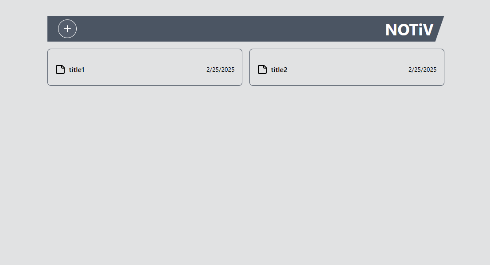
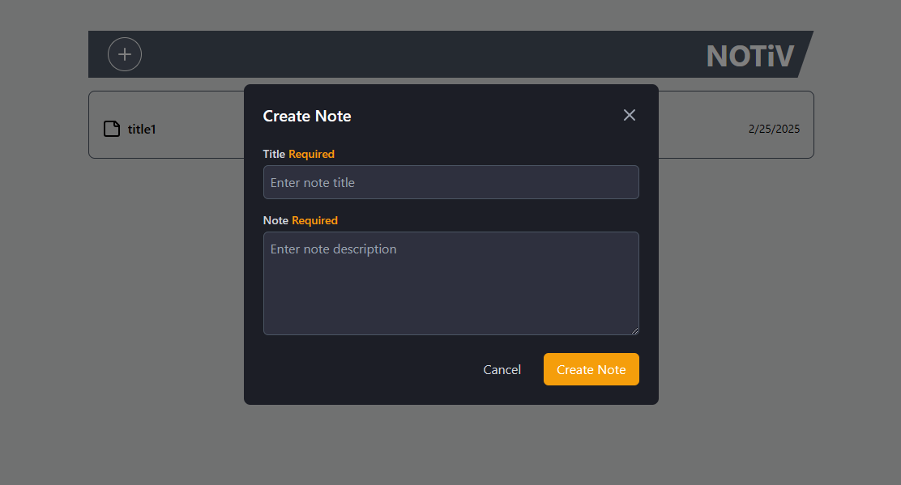
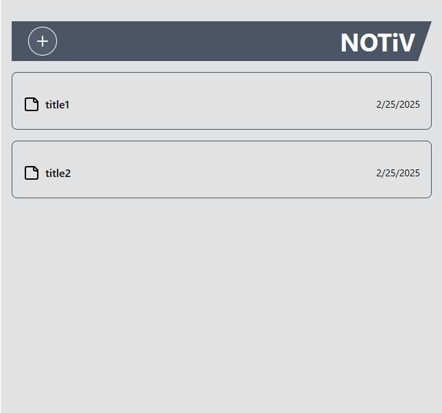

# Notes Application

This is a React-based web application that integrates with a Note API to manage and display notes. The app includes functionalities for viewing a list of notes, viewing note details in a modal, and creating/editing notes with client-side validation.

## Features

- **Notes List Page**: Displays all notes with an option to create new notes.
- **Note Detail Modal View**: Displays details of a single note with options to edit or delete the note.
- **Create/Edit Note Modal View**: Provides a form to create a new note or edit an existing one. Includes client-side validation for non-empty submissions and error messaging for failed API requests.

## Technologies Used

- **Frontend**: React, TypeScript, Vite, Tailwind CSS
- **State Management**: Zustand
- **HTTP Client**: Axios
- **Date Management**: date-fns
- **Icons**: Lucide React

## Setup

To run the application locally:

### Prerequisites

- Node.js (v16+)
- npm or yarn

### Installation

1. Clone the repository:
   ```bash
   git clone https://github.com/ChristianMarks-job/Ivim-Health-Assessment
   ```
2. Install dependencies:
   npm install
   # or
   yarn install

Development
npm run dev # or
yarn dev

Build
npm run build # or
yarn build

Time Spent
2 hours

Screenshots



